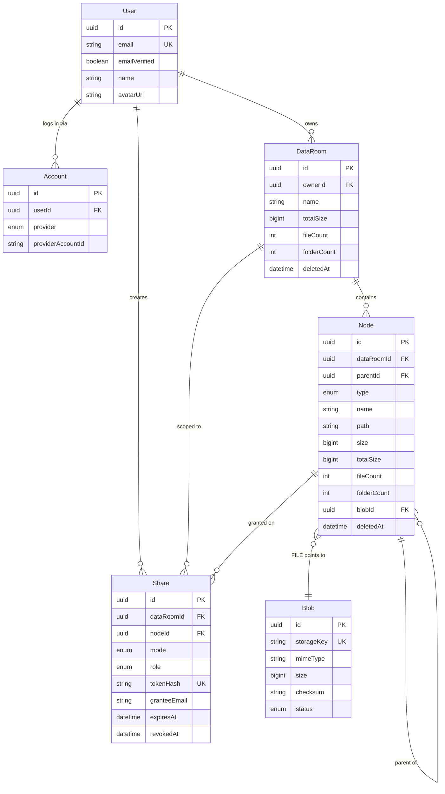

# Virtual Data Room

A secure repository for storing and sharing documents during due diligence, built for Acme Corp.'s
due-diligence workflow: one owner per Data Room, folders and files with breadcrumb navigation, and
two sharing modes — a public link and a per-user grant — both revocable.

## Hosted URLs

- **App:** `<fill in — production Vercel URL>`
- **API health check:** `<fill in>/api/health`

## Design decisions

The full log, with context and rationale for every call, is `docs/decisions.md` (34 entries) — this
is the highlight reel. Each number below is that file's entry, not an issue or task number.

- **One `nodes` table for folders and files**, a `type` discriminator, not two tables (#3). Listing,
  rename and move are written once; `UNIQUE (parent_id, name)` catches cross-type name collisions
  the application would otherwise have to police by hand.
- **`parent_id` is the source of truth; `path` is a denormalized materialized path** of ancestor
  UUIDs (#4). "Does a share exist on this node or an ancestor" — evaluated on nearly every request —
  becomes a string split and an indexed `IN`, not a recursive query.
- **Subtree size and item count are incremental counters, not computed on read** (#5): one `UPDATE`
  over the ancestor chain inside the same transaction as the mutation, so a 50-folder listing never
  triggers 50 subtree scans.
- **Soft delete, no trash UI** (#6). `deleted_at` keeps every row for the aggregates and for a clean
  `410 Gone` on a dead link; the brief's own rule against shipping unimplemented features is why
  there is no restore screen sitting on top of it.
- **A share is a grant on a node, resolved by ancestry — never materialized onto descendants** (#7).
  Revoking one row revokes an entire subtree instantly, with no cascade to run.
- **Google OAuth only, no password path** (#8) — one less credential store to secure correctly for
  an MVP whose brief already names social auth as sufficient.
- **`AccessScope` is a branded type, produced only by `AccessControlService`, and every repository
  method takes one as its first argument** (#9). A query that forgets to bound itself by scope is a
  type error, not a code-review miss.
- **Upload is a three-step protocol** — presign, direct browser `PUT` to storage, then a `complete`
  call that verifies the bytes and creates the node (#28) — so large files never transit the API
  process at all.
- **A `USER` share carries no token, and the two resolution paths (session vs. `/s/:token`) never
  cross** (#27) — a permissioned grant cannot be probed anonymously by guessing a URL shape.
- **One Data Room per owner, no create-room affordance, no room switcher** (#23) — the brief
  describes one Data Room per due-diligence deal, and multi-room support was judged to be scope the
  brief never asked for.

## Data model



The full Prisma schema, the raw SQL that Prisma cannot express (a partial unique index, a
`text_pattern_ops` prefix index, two `CHECK` constraints, the listing expression index), and every
invariant with its repair path live in `docs/data-model.md`.

## How it scales

### Total size and item count of a folder's whole subtree

Maintained incrementally, not computed on read: every mutation updates the ancestor chain (read from
`path`, no query needed) inside the same transaction, via `applyAggregateDelta`. A read is always a
column lookup, never a scan — the trade is one small `UPDATE` per write against O(1) reads
regardless of subtree size. A `recompute` script re-derives every aggregate from `parent_id` and
blob sizes if the invariant is ever suspected to have drifted.

### What changes when one Data Room holds 100,000 files

- **Listing** reads direct children only, off an index keyed on
  `(data_room_id, COALESCE(parent_id, data_room_id), type, lower(name))` — cost is independent of
  total room size, not the subtree. The `COALESCE` is what lets the room's own root listing use the
  same index as every folder's: root-level nodes have `parent_id IS NULL`.
- **Pagination is keyset, not offset**: `WHERE (type, lower(name)) > (cursor)`. Offset pagination
  degrades linearly with page number and skips or duplicates rows under concurrent writes; keyset
  stays constant-time and stable.
- **Aggregates are already denormalized** (see above), so no listing ever triggers a subtree scan.
- **Permission checks stay constant work**: ancestors come from splitting `path`, and the grant
  lookup is one indexed `IN` over at most `depth` ids.
- **Subtree delete and move** are single statements over a `text_pattern_ops` range scan on `path`,
  not recursive traversal.
- **Search** (extra credit, not built) would start on the existing `(data_room_id, name)` index for
  prefix matching, and move to `pg_trgm` if infix matching were required.

### How sharing extends to per-user roles (viewer/editor) without remodeling

It does not need a remodel, because `role` already lives on the `Share` row, not on the user: add
`EDITOR` to the `ShareRole` enum, have `AccessControlService` return `role` on the `AccessScope` it
produces, and gate write endpoints on it. Because grants resolve by ancestry rather than being
materialized onto every descendant, a role change on one `Share` row applies to its whole subtree
immediately, and two grants on the same node coexist by taking the stronger role.

## AI usage

This project was built with Claude Code end to end, but the heaviest use of it was not writing
application code — it was closing the design before any of that code existed. `docs/decisions.md`
holds 34 numbered decisions, each with its context, the alternatives considered, and why one was
picked; nothing in `docs/roadmap.md` was allowed a checkbox unless the decision behind it was
written down first. That log is what let later sessions — including ones that had never seen the
earlier design conversation — implement consistently instead of re-deciding the same question twice.

Implementation itself ran as phases, each with a written brief (a local, gitignored `notes/issues/`
directory — never committed, since it is process scaffolding, not project documentation), a
task-level checklist in `docs/roadmap.md`, and a session handover file so a long phase could stop at
a boundary it chose rather than wherever it ran out of context. Deviations from the plan — a library
that did not behave as its docs claimed, a cloud value that had to be observed rather than guessed —
were written down as they were found and, where they had to outlive the session, folded into
`CHANGELOG.md` or `docs/decisions.md` rather than left only in a local file.

Two habits mattered more than any single generated line of code: **verifying instead of assuming**
(an external system's behavior, a library's actual export, this repository's own code — checked by
reading the file or running the command, not recalled from training data) and **grilling the
design** before building against it — an adversarial review pass that stress-tested edge cases and
cross- checked new decisions against the existing vocabulary and decision log before anything
shipped against them.

## Explicitly out of scope

Turned down on purpose, not merely unstarted:

`BRIEF.md` names two extra-credit features — cross-room search and file versioning on a name
conflict — and neither was attempted; decision #1 time-boxed the build to the required set. The
upload auto-suffix (`contract (1).pdf`, bound at 3 attempts) looks adjacent to versioning but is not
one: it avoids a name collision by creating a new node, not by keeping old versions of one.

An `EDITOR` role does not exist — only `OWNER` and `VIEWER` do. That is not a gap so much as the
answer to the "how it scales" question above: `role` already sits on the grant as a column, so
`EDITOR` is additive later, not a remodel now.

Also turned down: a trash/restore UI (decision #6 — soft delete is for the aggregates and the `410`
contract, not to make deletion reversible from the browser); a durable, server-side audit log
(`CONTEXT.md`'s Activity queue is client-only and forgotten on refresh, on purpose); a PDF-specific
viewer library like `react-pdf` (decision #15 — the browser's own `<iframe>` was judged good
enough); and more than one room, a room switcher, or a way to create a second room (decision #23 —
one signed-in user, one owned room, is the whole model). Curated public demo links for this README
were considered and dropped too (decision #34): the first-login auto-grant described below already
demonstrates the graded permissioned share, and anyone who wants to see the public-link surface can
create one in their own room.

The orphan-blob sweeper and the `recompute` script are described below rather than built — see Known
limitations.

## Backlog

Groomed, not started — a written brief and a real design exist for each, they were simply not picked
up in the time available:

- **Table sorting and an "Activity" panel** (server-side sort on name/last-updated, plus a
  client-side log of upload/move/delete/share events) — groomed as a follow-on phase, seven issues,
  fully specified.
- **Recoverable share links** — whether a `LINK` share's token should become recoverable after
  creation, which would reopen decision #6's one-time-display rule. Raised, not yet decided;
  client-side caching of the plaintext was considered and rejected outright.
- **Sharing-source visibility** — surfacing "shared by {name}" on every page of a browsed grant, not
  only on the top-level "Shared with me" listing. Raised, not yet decided.

## Requirements

| Tool    | Version      | Notes                                                                                                                            |
| ------- | ------------ | -------------------------------------------------------------------------------------------------------------------------------- |
| Node.js | **>= 22.13** | Pinned to `22` in `mise.toml`. Required for `process.loadEnvFile`, which `prisma.config.ts` uses instead of a dotenv dependency. |
| pnpm    | **11.9.0**   | Do not install it separately — run `corepack enable` and the version in `packageManager` is used automatically.                  |
| Docker  | any current  | Runs Postgres and MinIO locally, and builds the API image.                                                                       |

## Setup

```bash
corepack enable                 # pnpm, at the version this repository pins
pnpm install --frozen-lockfile  # never plain `pnpm install` in CI or a container
cp .env.example .env            # then fill it in — see Configuration below
```

`pnpm install` runs `prisma generate` as a postinstall step, so the Prisma client exists before the
first typecheck.

To run a one-off script or command with the values from `.env` in its environment — the storage
checks below, a migration against a different database — load the file into the shell rather than
passing variables one by one:

```bash
set -a && source .env && set +a
```

`set -a` marks every subsequent assignment for export, so `source` exports the whole file; `set +a`
stops that again, so nothing later in the session is exported by accident. The application itself
does not need this — `@nestjs/config` reads `.env` directly.

Two supply-chain rules apply to every dependency change, and both live in `pnpm-workspace.yaml`
rather than `.npmrc` — pnpm 10+ does not read them from `.npmrc`:

- `saveExact` — versions are pinned exactly, never with a range.
- `minimumReleaseAge` — nothing published in the last 7 days is installed.

## Running locally

The whole stack, including Postgres and MinIO:

```bash
docker compose up
```

- SPA — http://localhost:5173
- API — http://localhost:3000/api/health
- MinIO console — http://localhost:9001

Or on bare metal, against the compose databases only:

```bash
docker compose up -d postgres minio
pnpm --filter @dr/contracts build   # the API type-checks against its declarations
pnpm dev
```

`pnpm dev` runs both apps in parallel. To run one of them alone:

```bash
pnpm --filter @dr/api dev     # Nest, watch mode, port 3000
pnpm --filter @dr/web dev     # Vite, port 5173 (override with VITE_PORT)
```

The contracts build above is for **`apps/api`** only. The web app resolves `@dr/contracts` to
`packages/contracts/src` through an alias in `vite.config.ts` and a matching `paths` entry in its
`tsconfig.json`, so a schema edit reaches the browser through HMR with no build step. The API still
consumes `dist`, so after editing a contract its type-check fails with "has no exported member"
until that build runs.

The browser always talks to **one origin**. In development that is Vite's `server.proxy` forwarding
`/api` to the API; in production it is the Vercel rewrite to Cloud Run. This is not a convenience —
it is what makes the session cookie first-party, and it means an authentication bug cannot exist
only on a laptop. See `docs/decisions.md` #10.

### Checks

```bash
pnpm typecheck && pnpm lint && pnpm test
```

All three must pass before any task is considered done. CI runs exactly these. Each one is also
available per workspace, which is what to reach for while iterating:

```bash
pnpm --filter @dr/web typecheck     # tsc --noEmit, browser project
pnpm --filter @dr/api test          # Vitest; the integration tests need compose Postgres up
pnpm --filter @dr/contracts test    # Vitest, no services needed
pnpm eslint apps/web/src            # lint one directory instead of the repository
```

### Build and format

```bash
pnpm build                          # every workspace: contracts tsc, api nest, web vite
pnpm --filter @dr/web build         # type-check then bundle the SPA into apps/web/dist
pnpm --filter @dr/web preview       # serve that bundle on 4173, with the same /api proxy
pnpm format                         # Prettier, write mode, whole repository
npx prettier --check .              # what to run before committing
```

### When the app looks wrong but the code looks right

Two failure modes here are stale processes rather than bugs, and both have cost a debugging session:

- **A dev server that has been running for a day.** A Nest watcher can stop restarting its child,
  leaving the API executing code from before the last edits — it answers `500` for a bug that is
  already fixed, and the source line in the stack trace does not match the file. Check when the
  process actually started (`ps -o lstart -p <pid>`) before believing it.
- **Vite's dependency pre-bundle.** Its cache is keyed on the lockfile and the config, not on the
  contents of a linked workspace package, so it can serve a stale build of one. That is now avoided
  for `@dr/contracts` by the source alias above; if a _different_ linked package is ever added,
  restart with `pnpm --filter @dr/web dev --force`.

### Database

```bash
pnpm --filter @dr/api db:migrate    # create a migration during development
pnpm --filter @dr/api db:deploy     # apply pending migrations (what the container does)
pnpm --filter @dr/api db:reset      # drop and rebuild the local database
```

`DATABASE_URL` is the pooled connection used at runtime; `DIRECT_URL` is the direct one used by
migrations. They are different on Neon and must not be swapped — PgBouncer in transaction mode
cannot carry the session-level statements a migration issues.

## Configuration

Every variable is listed and described in **`.env.example`**, which is the authoritative list.
Nothing below repeats a value — only where each one has to be set.

`.env` is gitignored and must never be committed. Neither must any of these values appear in a
workflow file, a Dockerfile, or this README.

### Local — `.env` at the repository root

Everything, including the Google OAuth client id and secret and the MinIO credentials. Keep it
**local-first**: the compose Postgres and MinIO values uncommented, and the Neon and GCS values
commented out beside them. Two uncommented `DATABASE_URL=` lines make the winner depend on parse
order, which is how a local run silently ends up against the production database. The API logs the
host and database name it resolved on boot for exactly this reason.

### Production secrets — Google Secret Manager

Read by the Cloud Run service at start-up. They never pass through a workflow file, a CI runner or a
log. Created (empty) by `scripts/gcloud-bootstrap.sh`, which then prompts for each value with the
input hidden.

| Secret                               | Holds                                             |
| ------------------------------------ | ------------------------------------------------- |
| `dataroom-database-url`              | Pooled Neon connection string                     |
| `dataroom-direct-url`                | Direct Neon connection string, for migrations     |
| `dataroom-google-client-secret`      | Google OAuth client secret                        |
| `dataroom-session-secret`            | Signing key for the session JWT, 32 bytes minimum |
| `dataroom-storage-access-key-id`     | GCS HMAC key id                                   |
| `dataroom-storage-secret-access-key` | GCS HMAC secret                                   |

### Production configuration — GitHub Actions repository variables

Not secrets: identifiers and public origins. Set them with
`gh variable set <NAME> --body '<value>'`. `deploy.yml` fails by name if one is missing.

| Variable                                               | Holds                                                |
| ------------------------------------------------------ | ---------------------------------------------------- |
| `GCP_PROJECT_ID`                                       | Google Cloud project id                              |
| `GCP_WIF_PROVIDER`                                     | Full resource name of the Workload Identity provider |
| `GCP_SERVICE_ACCOUNT`                                  | Email of the deploying service account               |
| `APP_URL`                                              | Public SPA origin, e.g. `https://<app>.vercel.app`   |
| `GOOGLE_CLIENT_ID`                                     | Google OAuth client id                               |
| `STORAGE_ENDPOINT`, `STORAGE_REGION`, `STORAGE_BUCKET` | GCS S3-compatible endpoint and bucket                |
| `TRUST_PROXY_HOPS` _(optional)_                        | Proxies in front of Cloud Run; defaults to `0`       |

`TRUST_PROXY_HOPS` is the one optional entry, and `deploy.yml` deliberately does **not** fail when
it is missing: its default is the safe direction. It feeds Express `trust proxy`, which exactly one
thing reads — the per-IP rate limit on the anonymous share surface. Too low and every caller shares
one bucket; too high and `X-Forwarded-For` becomes spoofable and the limit does nothing. It is a
property of the deployed request chain, so **observe it** from the service's own log rather than
guessing: the API logs the first anonymous share request's `req.ip` and raw header once per process
for that purpose.

Setting it in the Cloud Run console instead would not survive: `deploy.yml` uses `--set-env-vars`,
which replaces the service's whole environment on every deploy.

`GOOGLE_CALLBACK_URL` is deliberately **not** configurable: `deploy.yml` derives it as
`${APP_URL}/api/auth/google/callback`. It has to match the redirect URI registered on the OAuth
client exactly, and deriving it removes one of the places it can disagree.

There are **no GitHub secrets**. Deployment authenticates through Workload Identity Federation, so
no service-account key exists anywhere — see `docs/decisions.md` #22.

## Deployment

The SPA is on Vercel and the API on Cloud Run, with Vercel rewriting `/api/*` to Cloud Run so the
browser sees one origin.

One-time, run by the project owner in Cloud Shell — never on a development machine, which is where
no cloud credential belongs:

```bash
PROJECT_ID=<your-project> bash scripts/gcloud-bootstrap.sh
```

It enables the APIs, creates the Artifact Registry repository, the secrets, the runtime and
deploying service accounts, and the Workload Identity pool and provider. It is idempotent, so
re-running after a partial failure is safe. It prints the three `GCP_*` repository variables to set
afterwards.

Deploying the API, from the Actions tab or the CLI:

```bash
gh workflow run deploy.yml
gh run watch
```

`deploy.yml` triggers on `workflow_dispatch` **only**. There is no deploy on push: this repository
is public, and a push trigger would widen the set of events that can reach the identity pool for no
gain. The image is tagged with the commit SHA, never `latest`, so a Cloud Run revision names the
exact commit it runs and a rollback is a redeploy of a known tag.

The SPA deploys itself when Vercel receives a push, using the `buildCommand` in `vercel.json`.

### Building the API image locally

The image is validated on a developer machine before it ever reaches CI. The build context is the
repository root, because the workspace lockfile has to be in it:

```bash
docker build -f apps/api/Dockerfile -t dataroom-api:local .
```

## Known limitations

Deliberate, and named here rather than discovered. This is a take-home MVP; each of these is a state
the system tolerates and reports honestly, not a defect waiting to be found.

**Unreferenced bytes accumulate, and nothing collects them.** Two categories, one cause each: a
transfer abandoned before the completion call leaves a `PENDING` blob (older than an hour is safe to
sweep), and deleting a file leaves a `READY` one, because soft delete never touches storage —
`nodes_type_blob_check` requires a `FILE` to keep a non-null `blob_id`, so the row cannot be
detached, and deleting the bytes anyway would make a reversible operation irreversible in fact while
still looking reversible. A single scheduled job (daily or weekly; Cloud Run Jobs + Cloud Scheduler)
would collect both categories. Not built. The visible consequence: the quota is computed from node
aggregates, not from the bucket, so a room can report fewer bytes used than the bucket actually
holds — nothing breaks, since the authoritative quota check reads the same aggregates, but the two
numbers are not the same number.

**Every new sign-in is currently granted a share of the demo room, and this is temporary.** Acme
Corp.'s `Due Diligence` folder is auto-granted (`USER`, `VIEWER`) to every verified sign-in
(`DemoGrantService`, decision #32) so a reviewer with one Google account has a permissioned share to
look at without a second account. This is a reviewer-onboarding aid, not a feature of the product —
it is not per-user access control being bypassed, it stands in for "the reviewer has no second
account to grant to." Turned off after grading, in this order: set `AUTO_GRANT_ENABLED = false` and
redeploy, **then** run `pnpm demo:revoke` — reversed, anyone signing in during the gap is granted
again.

**A presigned upload URL is not single-use.** Verified against the real bucket: a second `PUT` to
the same URL returns `200` and replaces the object. For the lifetime of that URL (15 minutes from
the moment it is issued) the uploader can therefore change the bytes behind a file that has already
been recorded, while `size` and the folder aggregates keep the values read when the upload
completed.

The holder of that URL is the person who requested it — the room's owner, uploading their own file.
So this grants nobody any access they did not already have; what it allows is recording one size and
storing another, which makes the 200 MB quota evadable by someone willing to do it on purpose.
Closing it properly means making the key stop accepting writes once the upload is recorded, which is
a design change rather than a smaller number. Left as is, on purpose.

## Repository layout

```
apps/api/           NestJS API — modules + repository layer
apps/web/           Vite + React SPA
packages/contracts/ Zod schemas shared by both: validation, types and form resolvers
scripts/            One-time cloud bootstrap
docs/               Decisions, data model, architecture, roadmap
```

## Project documentation

This README covers setup and operation. Everything else lives here:

- [`CONTEXT.md`](./CONTEXT.md) — the domain vocabulary used in code, tests and UI.
- [`BRIEF.md`](./BRIEF.md) — the original brief this project was built against.
- [`docs/decisions.md`](./docs/decisions.md) — every accepted design decision, with its rationale.
  The place to check before assuming something was an oversight rather than a choice.
- [`docs/data-model.md`](./docs/data-model.md) — the schema and its ERD.
- [`docs/architecture.md`](./docs/architecture.md) — layers, access control, the upload flow, the
  error contract.
- [`docs/roadmap.md`](./docs/roadmap.md) — the task-level plan, phase by phase, including what
  shipped, what was turned down on purpose, and what is groomed but backlogged.
- [`docs/manual-e2e.md`](./docs/manual-e2e.md) — behaviour-level test cases for walking the app by
  hand.
- [`CHANGELOG.md`](./CHANGELOG.md) — what changed and why, phase by phase.
