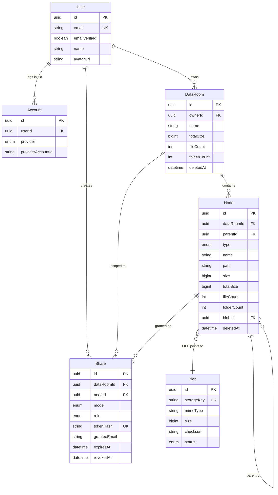

# Data Model

Draft schema for the Virtual Data Room. Rationale for each choice lives in `decisions.md` (#3 single
table, #4 materialized path, #5 aggregates, #6 soft delete, #7 sharing).

## ERD



## Prisma schema (draft)

```prisma
enum Provider   { GOOGLE }
enum NodeType   { FOLDER FILE }
enum BlobStatus { PENDING READY }
enum ShareMode  { LINK USER }
enum ShareRole  { VIEWER }          // EDITOR added later, no schema change

model User {
  id            String   @id @default(uuid()) @db.Uuid
  email         String   @unique                 // normalized lower-case
  emailVerified Boolean  @default(false)
  name          String?
  avatarUrl     String?
  createdAt     DateTime @default(now())

  accounts     Account[]
  dataRooms    DataRoom[]
  shares       Share[]
  createdNodes Node[]     @relation("NodeCreatedBy")
}

model Account {
  id                String   @id @default(uuid()) @db.Uuid
  userId            String   @db.Uuid
  provider          Provider
  providerAccountId String                        // Google `sub`
  createdAt         DateTime @default(now())

  user User @relation(fields: [userId], references: [id], onDelete: Cascade)

  @@unique([provider, providerAccountId])
  @@index([userId])
}

model DataRoom {
  id          String    @id @default(uuid()) @db.Uuid
  ownerId     String    @db.Uuid
  name        String
  totalSize   BigInt    @default(0)
  fileCount   Int       @default(0)
  folderCount Int       @default(0)
  createdAt   DateTime  @default(now())
  updatedAt   DateTime  @updatedAt
  deletedAt   DateTime?

  owner  User    @relation(fields: [ownerId], references: [id])
  nodes  Node[]
  shares Share[]

  @@index([ownerId, deletedAt])
}

model Node {
  id          String    @id @default(uuid()) @db.Uuid
  dataRoomId  String    @db.Uuid
  parentId    String?   @db.Uuid
  type        NodeType
  name        String
  path        String                              // '/<uuid>/<uuid>/' ancestors + self
  size        BigInt    @default(0)               // FILE: blob size, FOLDER: 0
  totalSize   BigInt    @default(0)               // FOLDER: subtree bytes
  fileCount   Int       @default(0)               // FOLDER: subtree files
  folderCount Int       @default(0)               // FOLDER: subtree folders
  blobId      String?   @db.Uuid
  createdById String    @db.Uuid
  createdAt   DateTime  @default(now())
  updatedAt   DateTime  @updatedAt
  deletedAt   DateTime?

  dataRoom  DataRoom @relation(fields: [dataRoomId], references: [id], onDelete: Cascade)
  parent    Node?    @relation("NodeChildren", fields: [parentId], references: [id])
  children  Node[]   @relation("NodeChildren")
  blob      Blob?    @relation(fields: [blobId], references: [id])
  createdBy User     @relation("NodeCreatedBy", fields: [createdById], references: [id])
  shares    Share[]

  // Folder listing + keyset pagination is an EXPRESSION index on lower(name), which
  // Prisma cannot declare — see raw SQL statement 5.
  @@index([dataRoomId, name])                     // future: search by name
  @@index([blobId])
}

model Blob {
  id         String     @id @default(uuid()) @db.Uuid
  storageKey String     @unique                   // `${dataRoomId}/${blobId}` — see #28
  mimeType   String
  size       BigInt
  checksum   String?
  status     BlobStatus @default(PENDING)
  createdAt  DateTime   @default(now())

  nodes Node[]
}

model Share {
  id           String    @id @default(uuid()) @db.Uuid
  dataRoomId   String    @db.Uuid
  nodeId       String?   @db.Uuid                 // null => the whole Data Room
  mode         ShareMode
  role         ShareRole @default(VIEWER)
  tokenHash    String?   @unique                  // LINK mode; SHA-256 of the token
  granteeEmail String?                            // USER mode; normalized lower-case
  createdById  String    @db.Uuid
  expiresAt    DateTime?
  revokedAt    DateTime?
  createdAt    DateTime  @default(now())

  dataRoom  DataRoom @relation(fields: [dataRoomId], references: [id], onDelete: Cascade)
  node      Node?    @relation(fields: [nodeId], references: [id], onDelete: Cascade)
  createdBy User     @relation(fields: [createdById], references: [id])

  @@index([granteeEmail, revokedAt])              // "shared with me"
  @@index([nodeId, revokedAt])                    // ancestor grant lookup
  @@index([dataRoomId, revokedAt])
}
```

## Raw SQL migrations (Prisma cannot express these)

```sql
-- 1. Name uniqueness within a folder: case-insensitive, ignoring soft-deleted rows.
--    COALESCE handles root-level nodes, where parent_id IS NULL and NULLs would
--    otherwise be treated as distinct by a plain unique index.
CREATE UNIQUE INDEX nodes_parent_name_unique
  ON nodes (data_room_id, COALESCE(parent_id, data_room_id), lower(name))
  WHERE deleted_at IS NULL;

-- 2. Subtree range scans: LIKE 'prefix%' needs a pattern-ops index to be used.
--    data_room_id leads because every subtree statement filters it by equality first
--    (equality column leading, range column second).
CREATE INDEX nodes_path_prefix
  ON nodes (data_room_id, path text_pattern_ops);

-- 3. Structural integrity between type and blob.
ALTER TABLE nodes ADD CONSTRAINT nodes_type_blob_check CHECK (
  (type = 'FILE'   AND blob_id IS NOT NULL) OR
  (type = 'FOLDER' AND blob_id IS NULL)
);

-- 4. Exactly one grant target shape per share mode.
ALTER TABLE shares ADD CONSTRAINT shares_mode_check CHECK (
  (mode = 'LINK' AND token_hash IS NOT NULL AND grantee_email IS NULL) OR
  (mode = 'USER' AND grantee_email IS NOT NULL AND token_hash IS NULL)
);

-- 5. Folder listing + keyset pagination. The sort key is lower(name), not name, so that
--    it matches the uniqueness domain in statement 1. Ordering on one and paginating on
--    the other is what drops or duplicates a row at a page boundary.
CREATE INDEX nodes_listing
  ON nodes (data_room_id, COALESCE(parent_id, data_room_id), type, lower(name))
  WHERE deleted_at IS NULL;
```

**Listing and cursor rule.** Listings are `ORDER BY type, lower(name)` and the keyset cursor carries
`(type, lower(name))` — never raw `name`. Statement 1 already makes `lower(name)` unique per folder,
so no tiebreaker column is needed.

## Invariants

These are the things that can silently drift. Each has an owner in code and a repair path.

| Invariant                                         | Maintained by                                                | Repair             |
| ------------------------------------------------- | ------------------------------------------------------------ | ------------------ |
| `path` = parent's `path` + own id + `/`           | node create, node move                                       | `recompute` script |
| folder aggregates = sum over live subtree         | create, delete, upload completion, move                      | `recompute` script |
| `DataRoom` aggregates = whole-room totals         | the same four call sites                                     | `recompute` script |
| a `FILE` always has a `READY` blob                | upload completion                                            | orphan sweep       |
| no cycles                                         | move guard: reject if `newParent.path.startsWith(node.path)` | n/a (prevented)    |
| a node under a deleted ancestor is itself deleted | subtree delete stamps the whole range in one statement       | `recompute` script |

The last one is an assumption, not a constraint the database enforces, and it is the one the `410`
design rests on. Reads check `deletedAt` on the node itself; walking its ancestors on every request
would be a second query for a state that must not exist. So a live row under a deleted ancestor
would be missing from its parent's listing and still readable by direct id — a deleted document
served to a counterparty. It holds only while subtree delete stays the single writer of `deleted_at`
on `nodes`: a second path (a restore cascade, a hand-run `UPDATE` during debugging) breaks it
silently.

`pnpm db:recompute` rebuilds `path` and every aggregate from `parent_id` and blob sizes. It exists
so that a drift is an operational annoyance rather than a data-integrity incident, and it is worth
mentioning in the README.

**Raw SQL bypasses the soft-delete extension**, so every raw statement filters `deleted_at IS NULL`
explicitly. The subtree delete is the one that bites: without it, a second delete re-stamps rows
already deleted and decrements ancestor aggregates for them twice, giving wrong counts in the
delete-warning dialog. Derive the aggregate delta from the same statement via `RETURNING type, size`
so the two cannot disagree.

**A blob's `storageKey` is its tenancy.** `Blob` has no `dataRoomId` column — a blob belongs to no
room until a node points at it — so the key format `${dataRoomId}/${blobId}` is load-bearing rather
than cosmetic (decision #28). `BlobRepository` filters
`storageKey: { startsWith: dataRoomId + '/' }` beside the id lookup, which is what stops a caller
attaching another room's blob to their own node. The same prefix is what a storage sweeper would
list by. Like a node's `path`, the key contains the row's own id and is `NOT NULL`, so the id comes
from `randomUUID()` in application code before the insert — a database-side default is not known in
time.

**Sizes on the wire are `number`, not `BigInt`.** `JSON.stringify` throws on `bigint`, so
`packages/contracts` defines `size` / `totalSize` as `number` and the repository converts at its
boundary. Safe by a wide margin: the 200 MB quota is ~45 million times below
`Number.MAX_SAFE_INTEGER`. `BigInt` stays in the database.

**Prisma needs two connection strings on Neon.** `DATABASE_URL` is the pooled string used at
runtime; `DIRECT_URL` is the direct one, used for migrations — PgBouncer in transaction mode cannot
carry the session-level statements that `prisma migrate` issues.

Prisma 7 no longer takes either on the `datasource` block, which is what actually shipped: the
pooled connection is handed to the driver adapter in `prisma.service.ts`, and the direct one is
declared in `prisma.config.ts`. The two-connection split is unchanged — only where each is declared.

## How it scales (answers to the brief's README questions)

### Total size and item count of a folder's whole subtree

Maintained incrementally, not computed on read. On every mutation the ancestor ids are taken from
`path` (no query) and updated in one statement inside the same transaction:

```ts
const ancestorIds = parent.path.split('/').filter(Boolean);
await tx.node.updateMany({
  where: { id: { in: ancestorIds } },
  data: { totalSize: { increment: delta }, fileCount: { increment: 1 } },
});

// The room counters are NOT covered by the statement above: a root-level node has no
// ancestors at all, so `ancestorIds` is empty and nothing would be updated. They are
// whole-room totals, so this runs on every mutation, in the same transaction.
await tx.dataRoom.update({
  where: { id: dataRoomId },
  data: { totalSize: { increment: delta }, fileCount: { increment: 1 } },
});
```

Both updates belong to `applyAggregateDelta`, and both are inside the caller's transaction.
Splitting them is how the room's figures drift away from the tree's — and since decision #24 those
figures are what the browser header renders at the room root, so the drift is visible rather than
latent.

Reads are free. The exact figure is also derivable at any time — which is what the recompute script
does:

```sql
SELECT count(*) FILTER (WHERE type = 'FILE')   AS files,
       count(*) FILTER (WHERE type = 'FOLDER') AS folders,
       coalesce(sum(size), 0)                  AS bytes
FROM nodes
WHERE data_room_id = $1 AND path LIKE $2 || '%' AND deleted_at IS NULL;
```

### What changes at 100,000 files in one Data Room

- **Listing** never touches the subtree — it reads direct children only, served by `nodes_listing`.
  Cost is independent of total room size.
- **Pagination** is keyset, not offset: `WHERE (type, lower(name)) > ($lastType, $lastName)`. Offset
  pagination degrades linearly and skips/duplicates rows under concurrent inserts; keyset stays
  constant-time and stable.
- **Aggregates** are already denormalized, so no listing triggers a subtree scan.
- **Permission checks** are constant work regardless of room size: ancestors come from a string
  split, and the grant lookup is one indexed `IN` over ≤ depth ids.
- **Subtree operations** (delete, move) remain single statements over a `text_pattern_ops` range
  scan rather than recursive traversal.
- **Search** (extra credit, not implemented) would use the `(data_room_id, name)` index for prefix
  matching, upgraded to `pg_trgm` for infix matching.

### Extending sharing to per-user roles (viewer/editor)

No remodeling required. `role` already lives on `Share`, not on the user:

1. Add `EDITOR` to the `ShareRole` enum.
2. Have `AccessControlService` return `role` in the `AccessScope`.
3. Add a `@RequireRole('EDITOR')` guard on write endpoints.

Because grants are resolved by ancestry rather than materialized, a role change applies to an entire
subtree instantly, and multiple grants on the same node coexist (the effective role is the strongest
applicable one).
